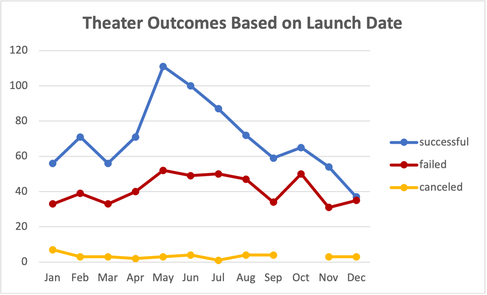
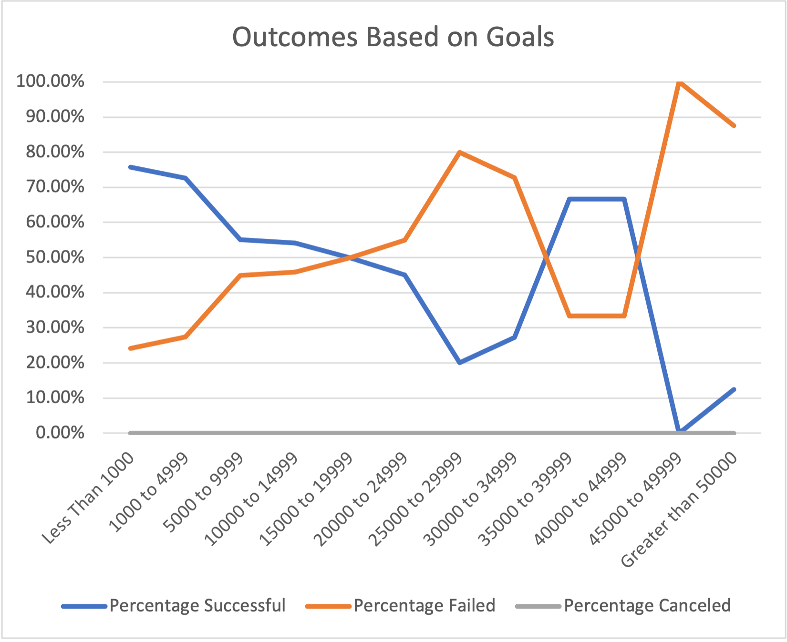

# kickstarter-analysis

## Overview of Project

### Purpose
An analysis of how different category kickstarter results fared in relation to their launch dates and funding goals, specifically theater and play campaigns. 

## Analysis and Challenges

### Analysis of Outcomes Based on Launch Date

By utilizing the Pivot Table and graphing functions, I was able to visualize campaign outcomes (successful, failed, and canceled) based on launch dates. 

In this specific analysis, we are comparing the monthly outcomes of theater campaigns.

### Analysis of Outcomes Based on Goals

With Excel functions, I created a table and graph to showcase the number and percentage of campaign outcomes based on goal dollar amount ranges. 

In this analysis, we are comparing the outcome of play campaigns.

### Challenges and Difficulties Encountered

During this module, this was the first time I ever worked with GitHub and .md files. I never knew how to create a repository, upload files, as well as working with GitHub Desktop to clone and manage remote and local files. In addition, I have only used plain-text documents to read files, but have never created the file and formatted it. 

With the help of the classes, modules and online resources like YouTube and GitHub Docs, I was able to learn how to work off of GitHub Desktop and complete my report with images and format it.

## Results

**What are two conclusions you can draw about the Outcomes based on Launch Date?**

1. Overall, there are more successful plays than those that have failed or been canceled. Of the 1369 total plays, 839 of the plays were successful. Therefore, if you have a kickstarter for a theater project, you will have a 61% chance of success. 

2. The most successful months are May and June, where 65-67% of the kickstarters were successful. Whereas the least successful month is December, where 51% of the kickstarters failed or were canceled. As a result, if you want the most success, it would be best to have a kickstarter in May or June. 

**What can you conclude about the Outcomes based on Goals?**

1. Play kickstarters with goals that are less than $15,000 are most likely to be successful. After the $15,000 mark, the likelihood of failed kickstarters for plays increased. 

**What are some limitations of this dataset?**

This dataset does not specify how the data was collected. As a result, the data collected from different sources can vary in quality and format. 

The dataset can also have bias, including under-represented populations, misinterpretation of the data, and cognitive bias just to name a few. 

**What are some other possible tables and/or graphs that we could create?**

With this dataset, here are 2 examples of tables and/or graphs that we could create: 

1. *Average time frame of campaigns based on outcomes*

	Do certain time frames (longer or shorter kickstarters) lead to more success or failure? With this table and graph, we could see if there is a correlation of how long a campaign was live and its correlation to its success rate. 

	We could filter it even more to see if this differs based on locations, parent categories or sub-categories. 

2. *Average donations of campaigns based on location or parent category*

	Do locations and/or parent categories impact the average donation amount? With this table or graph, we could determine if certain locations or parent categories have a higher or lower average donation amount.

	We could also determine if an average donation amount per location or parent category is correlated to a certain outcome. 

